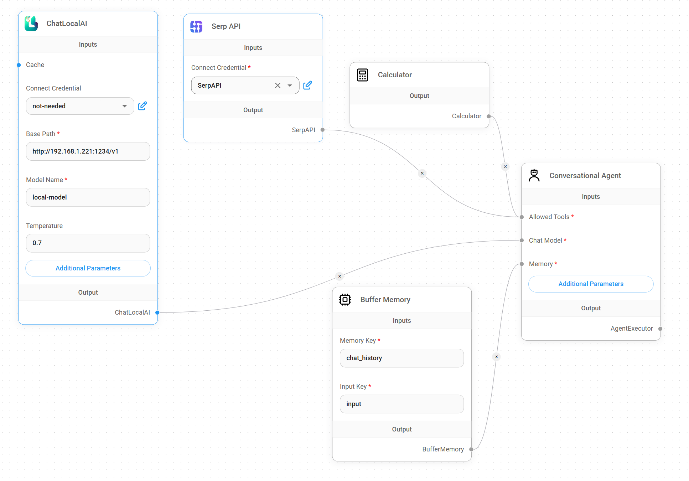
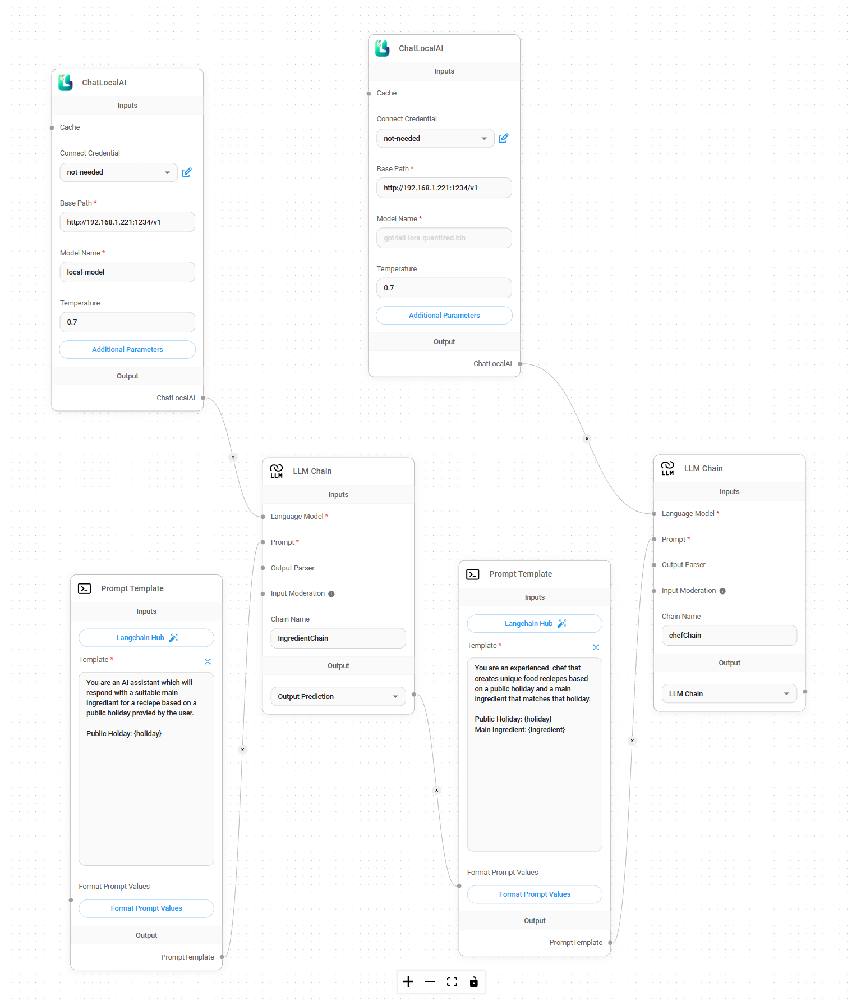

# Locally Hosted Langchain Projects

There are 2 really cool pipeline builder tools for working with Langchain called flowise and langflow. I found them both to have strengths and weaknesses however they are both very good for understanding how to build projects using Langchain.

I find making the project in flowise first and then converting it to langchain code using gpt is the fastest way to get a working product.

I am using a Postgres Server for structured data for testing SQL queries.

I also run everything in Docker. Will probably make a docker compose at some point but there are just 4 docker commands.

### Chat with files using PGVector store and local embeddings model:


# Quickstart

Install [LM Studio](https://lmstudio.ai/), download a model that will work on your GPU and start a local server.

Install [Docker Desktop](https://docs.docker.com/desktop/install/windows-install/) then run these commands in terminal:

```
docker run -d -p 7860:7860 logspace/langflow
docker run -d -p 8080:8080 localai/localai:v2.9.0-cublas-cuda12 bert-cpp
docker run -d -p 5432:5432 -e POSTGRES_PASSWORD=postgres pgvector/pgvector:pg16
git clone https://github.com/FlowiseAI/Flowise.git
cd Flowise
cp .env.example .env
docker-compose up -d
```

Create a [SerpApi: Google Search API](https://serpapi.com/) if you want to use search features.

Do your best to work the rest out.

## Flowise

```
git clone https://github.com/FlowiseAI/Flowise.git
cd Flowise
cp .env.example .env
docker-compose up -d
```

## Langflow

```
docker run -d -p 7860:7860 logspace/langflow
```

## Local Chat Models

I am using **[LM Studio](https://lmstudio.ai/)** to host my own chat model.

If you have 24GB of VRAM I particularly like the following model for use with langchain:

    TheBloke/deepseek-coder-33B-instruct-GGUF/deepseek-coder-33b-instruct.Q3_K_L.gguf

If your GPU has 12GB of VRAM you can try this model, but I have found the responses not always as good for prompting documents.

    TheBloke/Mistral-7B-Instruct-v0.2-GGUF/mistral-7b-instruct-v0.2.Q8_0.gguf

## Embeddings Models

I use LocalAI and one of the following models:

[bert-cpp](https://github.com/skeskinen/bert.cpp)

```
docker run -p 8080:8080 localai/localai:v2.9.0-cublas-cuda12 bert-cpp
```

[all-minilm-l6-v2	](https://huggingface.co/sentence-transformers/all-MiniLM-L6-v2)

```
docker run -p 8080:8080 localai/localai:v2.9.0-cublas-cuda12 all-minilm-l6-v2
```

## Vector Store

I am using a Postgres Server with PGVector extension installed as my Vector Store.

```
docker run -p 5432:5432 -e POSTGRES_PASSWORD=postgres pgvector/pgvector:pg16
```

Your user will be postgres, change the password to something. The data will be loaded to the public.document schema.table.

I find this just as easy to use and understand as Pinecone except it's free. I am sure you could do some load balancing and horizontal scaling if you wanted to match its performance.

## Serp API

[SerpApi: Google Search API](https://serpapi.com/) 	Use this for adding search to your models. It grabs a few pages and loads them as context to your prompt.

## Calculator

When your Chat model detects a maths question it attempts to use numpy as it's tool to do the calculations as a context to the prompt.

## Example Architectures

### Chat with Search and Calculator



### Chat with multiprompts


