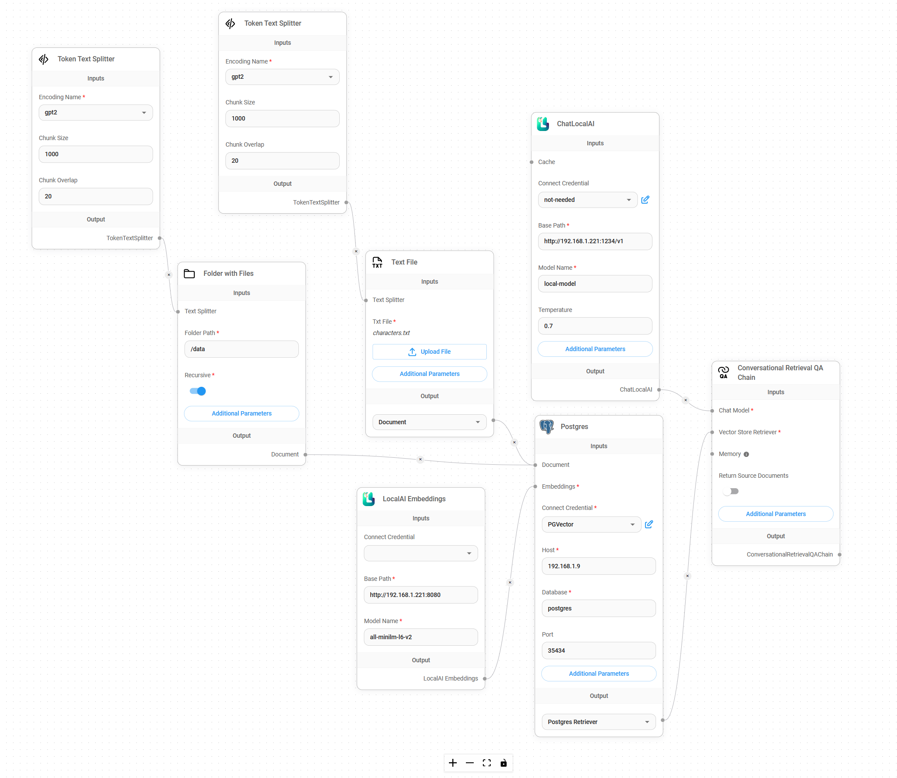

# Langchain Projects

There are 2 really cool pipeline builder tools for working with Langchain called flowise and langflow. I found them both to have strengths and weaknesses however they are both very good for understanding how to build projects using Langchain.

I find making the project in flowise first and then converting it to langchain code using gpt is the fastest way to get a working product.

I am using a Postgres Server for structured table storage.

I also run everything in Docker. Will probably make a docker compose at some point but there are just 4 docker commands.

## Flowise

docker run -ti -p 3000:3000 flowiseai/flowise flowise

## Langflow

docker run -ti -p 7860:7860 logspace/langflow:latest langflow

## Local Chat Models

I am using **[LM Studio](https://lmstudio.ai/)** to host my own chat model.

I particularly like the following models for their consistantly fast and good responses:

    TheBloke**/**Mistral-7B-Instruct-v0.2-GGUF**/**mistral-7b-instruct-v0.2.Q8_0.gguf

    TheBloke**/**deepseek-coder-33B-instruct-GGUF**/**deepseek-coder-33b-instruct.Q3_K_L.gguf

## Embeddings Models

I use LocalAI and one of the following models:

[bert-cpp](https://github.com/skeskinen/bert.cpp)  		docker run -ti -p 8080:8080 localai/localai:v2.9.0-ffmpeg-core bert-cpp

[all-minilm-l6-v2	](https://huggingface.co/sentence-transformers/all-MiniLM-L6-v2)docker run -ti -p 8080:8080 localai/localai:v2.9.0-ffmpeg all-minilm-l6-v2

## Vector Store

I am using a Postgres Server with PGVector extension installed as my Vector Store.

docker pull pgvector/pgvector:pg16

I find this just as easy to use and understand as Pinecone except it's free. I am sure you could do some load balancing and horizontal scaling if you wanted to match its performance.

## Serp API

Use this for adding search to your models. It grabs a few pages and loads them as context to your prompt.

## Calculator

When your Chat model detects a maths question it attempts to use numpy as it's tool to do the calculations as a context to the prompt.

## Example Architectures

### Chat with Search and Calculator

### Chat with multiprompts

### Chat with files using vector store and embeddings
